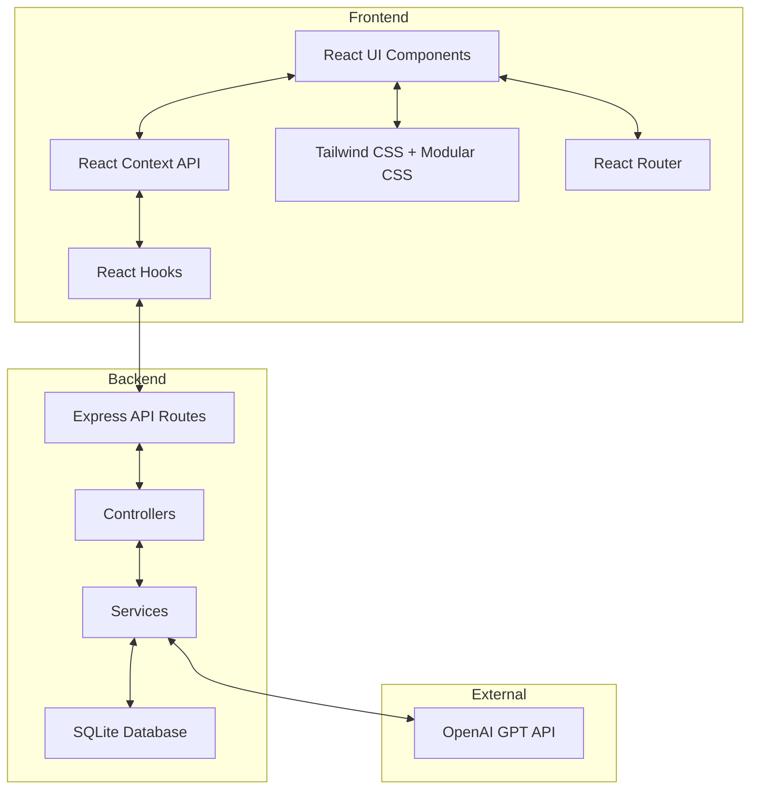
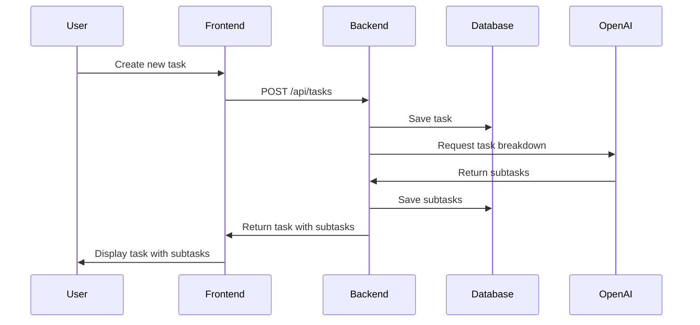

# Task Management System with AI-Powered Task Breakdown

## Project Overview

We'll create a sophisticated task management system that demonstrates modern web development practices while leaving strategic gaps for interviewees to implement. The system will allow users to create high-level tasks and use OpenAI's GPT API to automatically break them down into actionable subtasks.

### Core Technologies

**Backend:**
- Node.js with Express
- RESTful API architecture
- SQLite for database (easy in-repo solution)
- Proper error handling and data validation

**Frontend:**
- React with React Router for client-side routing
- Vite for project setup and bundling
- React hooks for state and effects
- Context API for state management
- Tailwind CSS for styling with modular CSS options
- Responsive design principles

**Testing:**
- Vitest for unit and integration tests

**AI Integration:**
- OpenAI GPT API for task breakdown

## System Architecture



## Data Flow



## Directory Structure

```
task-management-system/
├── README.md                 # Project documentation
├── package.json              # Project dependencies and scripts
├── .gitignore                # Git ignore file
├── .eslintrc                 # ESLint configuration
├── .prettierrc               # Prettier configuration
├── backend/
│   ├── server.js             # Express server setup
│   ├── db/
│   │   ├── index.js          # Database connection
│   │   ├── migrations/       # Database migrations
│   │   └── seeds/            # Seed data
│   ├── routes/
│   │   ├── index.js          # Route aggregation
│   │   └── tasks.js          # Task routes
│   ├── controllers/
│   │   └── tasks.js          # Task controllers
│   ├── services/
│   │   ├── taskService.js    # Task business logic
│   │   └── aiService.js      # OpenAI integration
│   ├── models/
│   │   └── task.js           # Task model
│   ├── middleware/
│   │   ├── errorHandler.js   # Error handling middleware
│   │   └── validation.js     # Request validation
│   └── utils/
│       └── logger.js         # Logging utility
├── frontend/
│   ├── index.html            # HTML template
│   ├── vite.config.js        # Vite configuration
│   ├── public/               # Static assets
│   ├── src/
│   │   ├── main.jsx          # Entry point
│   │   ├── App.jsx           # Main App component
│   │   ├── routes/           # Route definitions
│   │   │   ├── index.jsx     # Route configuration
│   │   │   ├── Home.jsx      # Home page
│   │   │   ├── TaskList.jsx  # Tasks list page
│   │   │   └── TaskDetail.jsx # Task detail page
│   │   ├── components/       # UI components
│   │   │   ├── common/       # Reusable components
│   │   │   │   ├── Button.jsx
│   │   │   │   ├── Input.jsx
│   │   │   │   └── Card.jsx
│   │   │   ├── layout/       # Layout components
│   │   │   │   ├── Header.jsx
│   │   │   │   ├── Sidebar.jsx
│   │   │   │   └── Footer.jsx
│   │   │   └── tasks/        # Task-specific components
│   │   │       ├── TaskItem.jsx
│   │   │       ├── TaskForm.jsx
│   │   │       ├── SubtaskList.jsx
│   │   │       └── AIBreakdownButton.jsx
│   │   ├── context/
│   │   │   └── TaskContext.jsx # Task state management
│   │   ├── hooks/
│   │   │   ├── useTasks.js   # Custom hooks for tasks
│   │   │   └── useAI.js      # Hook for AI integration
│   │   ├── services/
│   │   │   └── api.js        # API client
│   │   ├── utils/
│   │   │   └── helpers.js    # Helper functions
│   │   └── styles/
│   │       ├── index.css     # Global styles with Tailwind imports
│   │       └── components/   # Modular CSS files for custom styling
│   ├── tailwind.config.js    # Tailwind configuration
│   └── postcss.config.js     # PostCSS configuration
└── tests/
    ├── backend/              # Backend tests
    │   ├── unit/
    │   │   ├── services/
    │   │   └── controllers/
    │   └── integration/
    │       └── api/
    └── frontend/             # Frontend tests
        ├── unit/
        │   ├── components/
        │   └── hooks/
        └── integration/
            └── flows/
```

## Implementation Details

### Backend Implementation

1. **Express Server Setup**
   - Configure Express with middleware for JSON parsing, CORS, etc.
   - Set up error handling middleware
   - Configure routes

2. **Database Setup**
   - Set up SQLite database with appropriate schema
   - Create migrations for tasks and subtasks tables
   - Implement seed data for testing

3. **API Endpoints**

```
GET    /api/tasks          # Get all tasks
POST   /api/tasks          # Create a new task
GET    /api/tasks/:id      # Get a specific task
PUT    /api/tasks/:id      # Update a task
DELETE /api/tasks/:id      # Delete a task
POST   /api/tasks/:id/breakdown # Generate subtasks using AI
```

4. **Task Model**

```javascript
// Task schema
{
  id: INTEGER PRIMARY KEY,
  title: TEXT NOT NULL,
  description: TEXT,
  status: TEXT DEFAULT 'pending',
  priority: TEXT DEFAULT 'medium',
  dueDate: TEXT,
  createdAt: TEXT DEFAULT CURRENT_TIMESTAMP,
  updatedAt: TEXT DEFAULT CURRENT_TIMESTAMP
}

// Subtask schema
{
  id: INTEGER PRIMARY KEY,
  taskId: INTEGER NOT NULL,
  title: TEXT NOT NULL,
  description: TEXT,
  status: TEXT DEFAULT 'pending',
  createdAt: TEXT DEFAULT CURRENT_TIMESTAMP,
  updatedAt: TEXT DEFAULT CURRENT_TIMESTAMP,
  FOREIGN KEY (taskId) REFERENCES tasks(id) ON DELETE CASCADE
}
```

5. **OpenAI Integration**
   - Create a service to interact with OpenAI API
   - Implement prompt engineering for effective task breakdown
   - Handle API responses and error cases

### Frontend Implementation

1. **React Setup with Vite**
   - Set up React application using Vite for fast development
   - Configure React Router for client-side routing
   - Set up route configuration

2. **Styling with Tailwind CSS**
   - Configure Tailwind CSS for utility-first styling
   - Set up PostCSS for processing
   - Create a theme with custom colors, spacing, etc.
   - Allow for modular CSS where component-specific styles are needed

3. **Component Structure**
   - Create reusable UI components
   - Implement task list, task details, and task creation forms
   - Design UI for displaying subtasks generated by AI

4. **State Management**
   - Use Context API for global state management
   - Implement custom hooks for task operations
   - Handle loading, error, and success states

5. **API Integration**
   - Create API client for communicating with backend
   - Implement data fetching and mutation functions
   - Handle API errors gracefully

6. **Routing**
   - Implement React Router with route definitions
   - Create route components for different pages
   - Set up nested routes for task details

### Testing Strategy

1. **Backend Tests**
   - Unit tests for services and controllers
   - Integration tests for API endpoints
   - Mock OpenAI API for testing AI integration

2. **Frontend Tests**
   - Component tests for UI components
   - Hook tests for custom hooks
   - Integration tests for user flows

## Assessment Gaps for Interviewee to Implement

We'll leave the following specific gaps for interviewees to implement, in order of approach:

1. **Backend: Write the endpoint to return all created tasks**
   - Implement the GET /api/tasks endpoint in the backend
   - Include proper error handling and response formatting
   - Add sorting and filtering capabilities (optional enhancement)

2. **Frontend: Build frontend to fetch tasks and feed them to an existing task list component**
   - Implement API call to fetch tasks from the backend
   - Connect the API response to the existing task list component
   - Handle loading and error states
   - Implement refresh functionality

3. **AI Integration: Add subtask generation functionality to frontend and backend**
   - Implement the OpenAI service in the backend
   - Create the POST /api/tasks/:id/breakdown endpoint
   - Add UI components for triggering task breakdown
   - Handle the API response and error states

4. **Frontend Enhancement: Update task list to show subtasks per each task**
   - Modify the task list component to display subtasks
   - Implement collapsible/expandable subtask lists
   - Add status tracking for subtasks
   - Ensure proper styling and responsiveness

## Documentation

1. **README.md**
   - Project overview and purpose
   - Setup instructions
   - Available scripts
   - API documentation
   - Testing instructions
   - Interviewee guide with clear instructions on which parts to implement
   - Expected functionality for each implementation task
   - Time allocation suggestions

2. **Code Documentation**
   - JSDoc comments for functions and components
   - Inline comments for complex logic
   - Type definitions for better code understanding

## Development Workflow

1. Set up the project structure and configuration files
2. Implement the backend core functionality
3. Create the database schema and migrations
4. Implement the frontend foundation with React and Tailwind CSS
5. Integrate OpenAI API for task breakdown
6. Add tests for implemented features
7. Document the codebase and create the interviewee guide
8. Identify and mark gaps for interviewees to implement